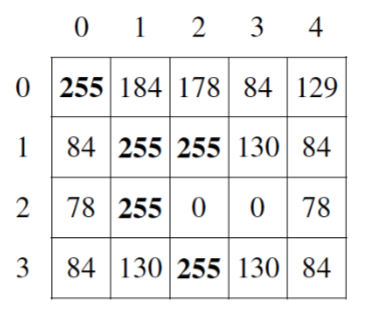

# 9.1-Gray-Image

A grayscale image is represented by a 2-dimensional rectangular array of pixels (picture elements). A pixel is an integer value that represents a shade of gray. In this question, pixel values can be in the range from 0 through 255, inclusive. A black pixel is represented by 0, and a white pixel is represented by 255. 

**Part A.**

Write the method countWhitePixels that returns the number of pixels in the image that contain the value WHITE. For example, assume that pixelValues contains the following image.

A call to countWhitePixels method would return 5 because there are 5 entries (shown in boldface) that have the value WHITE.

**Part B.**

Write the method processImage that modifies the image by changing the values in the 
instance variable pixelValues according to the following description. The pixels in the image are processed one at a time in row-major order. Row-major order processes the first row in the array from left to right and then processes the second row from left to right, continuing until all rows are processed from left to right. The first index of pixelValues represents the row number, and the second index represents the column number.

The pixel value at position (row, col) is decreased by the value at position (row + 2, col + 2) if such a position exists. If the result of the subtraction is less than the value BLACK, the pixel is assigned the value of BLACK. The values of the pixels for which there is no pixel at position (row + 2, col + 2) 
remain unchanged. You may assume that all the original values in the array are within the range 
[BLACK, WHITE], inclusive.

The following diagram shows the contents of the instance variable pixelValues before and after a call to processImage. The values shown in boldface represent the pixels that could be modified in a grayscale image with 4 rows and 5 columns.

  
  
